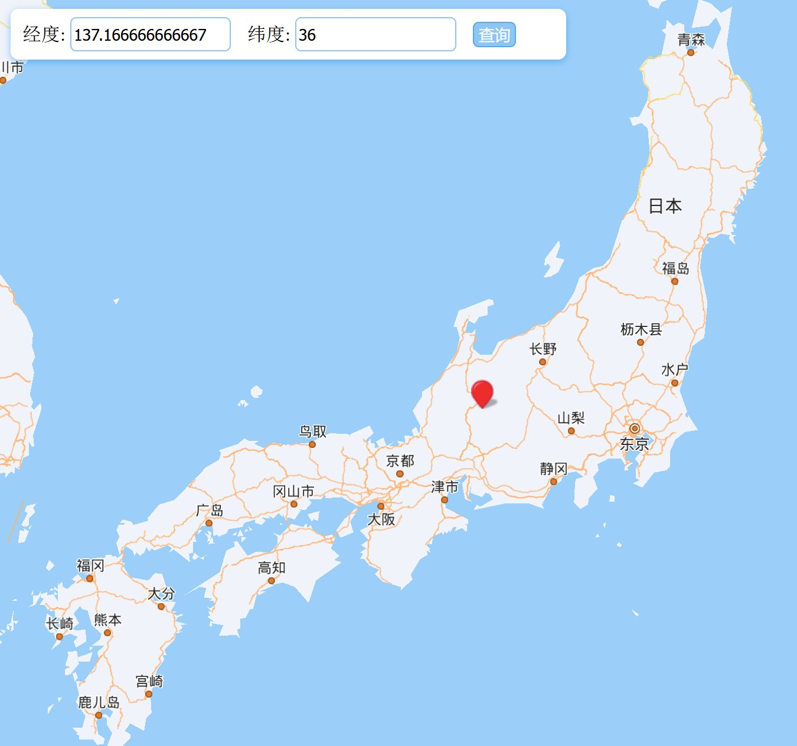
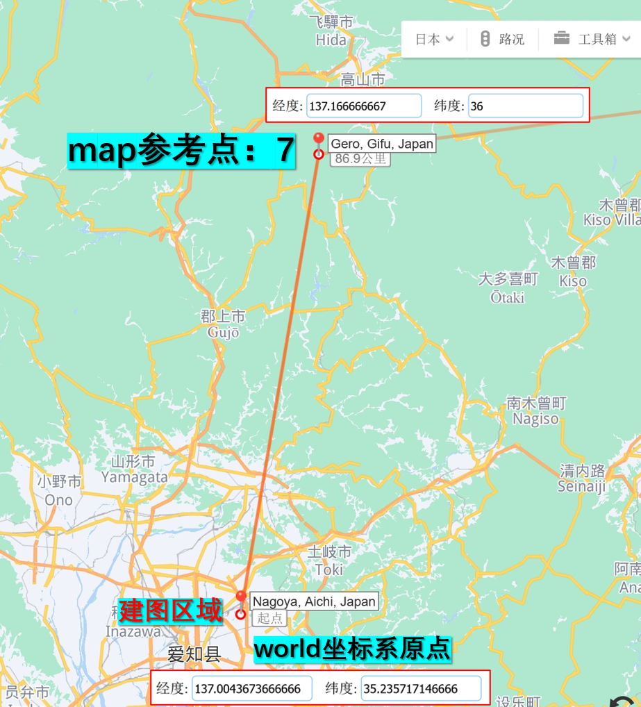
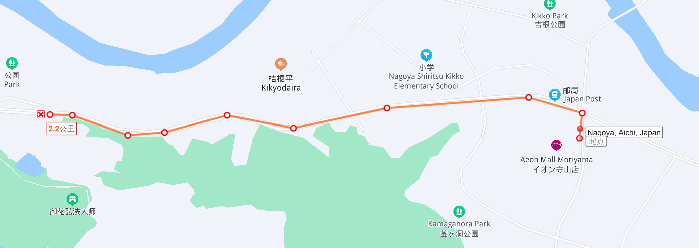
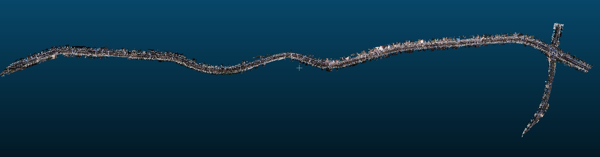
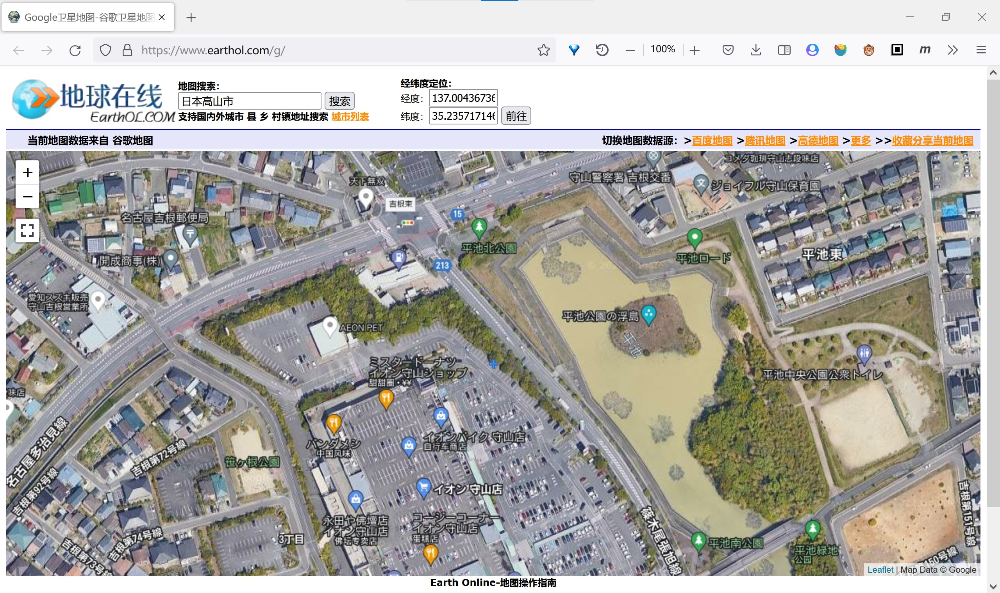
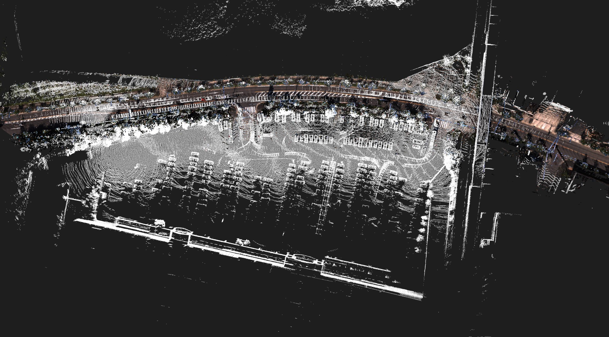

# 基于官方demo进行定位优化
# 项目说明
1. 在运行autoware官方demo的时候，如果将数据包从`0s`开始播放，由于开始一段时间内，车辆所在位置没有点云地图，会导致定位失败，车辆位置到处乱飘；
2. 为了解决这个问题，需要利用前面一段时间的传感器数据，自行建立点云地图，并与官方提供的地图拼接在一起；
3. 点云拼接需要用到gnss粗定位和ndt精定位.

# 分析
要构建点云地图并与官方地图拼接，首先需要了解官方的地图是如何构建的，涉及到哪几个坐标系.

1. `map`坐标系  
首先在运行官方demo的时候，可以看到有一个距离地图非常远的坐标系，递归查看如下文件:  
```
- autoware_quickstart_examples/launch/rosbag_demo/my_localization.launch 
  - <include file="$(find gnss_localizer)/launch/nmea2tfpose.launch"/>
    - <node pkg="gnss_localizer" type="nmea2tfpose" name="nmea2tfpose" output="log"/>  <arg name="plane" default="7"/>
      - autoware/core_perception/gnss_localizer/nodes/nmea2tfpose/nmea2tfpose_node.cpp
      - autoware/core_perception/gnss_localizer/nodes/nmea2tfpose/nmea2tfpose_core.cpp
      - autoware/core_perception/gnss_localizer/nodes/nmea2tfpose/nmea2tfpose_core.h
        - autoware/common/gnss/src/geo_pos_conv.cpp   
          ```cpp
          else if (num == 7)
          {//注意这里lon, lat命名有误，刚好反转了，后面在`nmea2tfpose_core.cpp`中把经纬度转换为tf发布的时候又会反转一下x和y坐标. 算是一种拙劣的补救
            lon_deg = 36;
            lon_min = 0;
            lat_deg = 137;
            lat_min = 10;
          }
          ```
```
可以知道，所谓地图坐标系`map`，就是在事先选取一个经纬度值，作为参考点，默认选择的是`7号参考点`: 东经137度10分，北纬36度.通过查看百度地图，可以看到该位置在日本.
- [根据经纬度定位 - 百度地图](https://lbsyun.baidu.com/jsdemo/demo/yLngLatLocation.htm)

<div align="center">

</div> 

2. `world`坐标系   
通过查看官方数据集中给出的`tf.launch`，可以发现该坐标系应该在人为给定的一个与`map`坐标系相对位置固定的一个点，且可以估计该坐标系原点在建图目标附近.通过具体数据可以得知，world坐标系原点在map坐标系原点(7号参考点)以西14771米，以南84757米，海拔上方39米处.
```
ubuntu@ubuntu:~$ cat .autoware/data/tf/tf.launch 
<!---->
<launch>
<!-- worldからmapへのtf -->
<node pkg="tf"  type="static_transform_publisher" name="world_to_map" args="14771 84757 -39 0 0 0 /world /map 10" />

<!-- mapからmobilityへのtf -->
<node pkg="tf"  type="static_transform_publisher" name="map_to_mobility" args="0 0 0 0 0 0 /map /mobility 10" />

</launch>
```

查看地图可以找到该点
<div align="center">

</div> 

3. `gps`坐标系  
在运行官方demo时，可以看到gps坐标架是跟着汽车不断移动的，说明该坐标表示的实际上就是汽车的gps定位. 

3.1) 通过官方数据包，可以看到gps数据是以nmea报文的形式表示的

```bash
ubuntu@ubuntu:~$ rosbag info .autoware/sample_moriyama_150324.bag 
path:        .autoware/sample_moriyama_150324.bag
version:     2.0
duration:    7:59s (479s)
start:       Mar 24 2015 08:40:50.33 (1427157650.33)
end:         Mar 24 2015 08:48:49.50 (1427158129.50)
size:        7.9 GB
messages:    16768
compression: none [4788/4788 chunks]
types:       nmea_msgs/Sentence      [9f221efc5f4b3bac7ce4af102b32308b]
             sensor_msgs/PointCloud2 [1158d486dd51d683ce2f1be655c3c181]
topics:      /nmea_sentence   11980 msgs    : nmea_msgs/Sentence     
             /points_raw       4788 msgs    : sensor_msgs/PointCloud2

ubuntu@ubuntu:~$ rosmsg show nmea_msgs/Sentence 
std_msgs/Header header
  uint32 seq
  time stamp
  string frame_id
string sentence

ubuntu@ubuntu:~$ rosmsg show nmea_msgs/[双击Tab]
nmea_msgs/Gpgga           nmea_msgs/Gpgsv           nmea_msgs/Gprmc
nmea_msgs/Gpgsa           nmea_msgs/GpgsvSatellite  nmea_msgs/Sentence
```

- [NMEA协议解析 - 知乎](https://zhuanlan.zhihu.com/p/434992232)

3.2) 实际运行，可以看到如下具体报文内容  
```bash
ubuntu@ubuntu:~$ roscore
ubuntu@ubuntu:~$ rosbag play .autoware/sample_moriyama_150324.bag 
ubuntu@ubuntu:~$ rostopic echo /nmea_sentence | grep sentence
sentence: "$GNRMC,004035.20,A,3514.1430288,N,13700.2620420,E,0.0133,188.554,240315,7.320,E,D*1F" # 推荐定位信息 北纬: 35°14.1430288', 东经: 137°00.2620420'
sentence: "$GPGGA,004035.20,3514.1430288,N,13700.2620420,E,4,12,0.81,47.3504,M,38.4566,M,1.2,0556*41"   #GPS定位信息
sentence: "$GNVTG,188.554,T,195.874,M,0.0133,N,0.0247,K,D*3B" # 地面速度信息
sentence: "QQ02C,INSATT,V,004035.20,7.232,14.380,223.224,@A3" # 航向: 时间戳，roll, pitch, yaw
sentence: "WW03D,INSDAT,004035.20,2.541,-1.246,-9.382,0.252,-0.107,-0.061,@E6"
sentence: "$GNRMC,004035.40,A,3514.1430181,N,13700.2620311,E,0.1828,215.172,240315,7.320,E,D*13"
sentence: "$GPGGA,004035.40,3514.1430181,N,13700.2620311,E,4,12,0.81,47.3559,M,38.4566,M,1.4,0556*46"
sentence: "$GNVTG,215.172,T,222.492,M,0.1828,N,0.3386,K,D*3A"
sentence: "QQ02C,INSATT,V,004035.40,7.226,14.376,223.220,@34"
sentence: "WW03C,INSDAT,004035.40,2.601,-1.212,-9.373,0.069,0.374,-0.481,@52"
```

这些报文信息在autoware中通过`nmea2tfpose`节点进行解析, 位于`~/autoware-1.13/src/autoware/core_perception/gnss_localizer/nodes/nmea2tfpose`.
该节点从参数服务器获取`plane`参数，作为GPS坐标的参考原点，然后订阅话题`"nmea_sentence"`，接收到报文消息后进行解析，
解析出`lat, lon, h, row, pitch, yaw`, 其中`lat, lon, h`作为参数传递给`geo_.set_llh_nmea_degrees(lat, lon, h);`,与参考点比较后转换为`x, y, z`
转换成GNSS设备相对于GPS原点的位姿，发布到话题上`"gnss_pose"`，同时发布从`map`到`gps`的TF.注意GPS坐标架是固定在GNSS接收机上并跟随车体一起移动的.


查看第一帧和最后一帧的`$GNRMC`报文，可以看到起点和终点的经纬度分别为
```
起点： 东经 137.0043673666666 北纬 35.235717146666
终点： 东经  136.987711975 北纬 35.223221535
```

3.3) 地图查看  

查看百度地图并与官方提供的点云地图比对，可以找到建图位置如下,图中红线标出的是bag数据中汽车运动的轨迹.  
<div align="center">


</div> 

访问[地球在线](https://www.earthol.com/g/)可以输入经纬度立刻找到起点位置，并可以看到非常清晰的街景地图.  
<div align="center">

</div> 


# 整体思路

首先该作业需要使用数据包的前140s构建点云地图，建图过程中令world与map坐标系重合，并保存一个点云文件，我把它命名为`local_map.pcd`,表示仅用局部数据构建的地图，其坐标原点就是采集第一帧点云数据时`base_link`的位置；
而官方给的点云地图坐标原点在7号参考点处，我把它称作全局地图坐标系`global_map`(实际上就是官方demo中的`map`坐标系)。
要把两张地图拼接起来，就需要计算`local_map`到`global_map`的坐标变换，这两个坐标系的大致位姿可以通过gps信息获得。

`autoware`中的`gnss`、`gnss_localizer`两个功能包以7号参考点为`map`坐标系的原点，计算gps数据的相对位姿，发布在`/gnss_pose`话题上。因此我们可以读取第一帧的`/gnss_pose`消息作为粗匹配的转换矩阵.

```
~/autoware-1.13/src/autoware/common/gnss
~/autoware-1.13/src/autoware/core_perception/gnss_localizer
```

此后，我们需要实现一个`gnss_projection`节点，订阅`/gnss_pose`作为初始变换矩阵，把`local_map`匹配到`global_map`上.

1. 用官方数据包`sample_moriyama_150324.bag`的前140s构建点云地图`local_map.pcd`， 这一步建图时可直接令`world`和`map`重合;
2. 通过`map_file`功能包读取官方的点云文件`bin_Laser-*.pcd`作为全局点云地图`global_map`，发布在`map`坐标系，只需读取起点附近的一小部分即可
3. 启动`gnss`、`gnss_localizer`两个功能包，订阅`/nmea_sentence`话题，并以`7号参考点`为map原点，发布`gps`的位姿到`/gnss_pose`话题上
4. 创建一个节点，订阅`/gnss_pose`话题，并仅保存第一帧数据，作为`local_map.pcd`的`world`坐标系相对于`map`坐标系的位姿，同时作为`local_map`到`global_map`变换的初始位姿，也就是`gnss粗匹配`
5. 调用`pcl::NormalDistributionsTransform`进行精匹配，并输转换后的`local_map_transformed.pcd`以及转换矩阵


# 实现
功能包放在[catkin_ws/src/](catkin_ws/src/)文件夹下.  
- [gnss](catkin_ws/src/gnss)
- [gnss_localizer](catkin_ws/src/gnss_localizer)
- [gnss_projection](catkin_ws/src/gnss_projection)
- [map_file](catkin_ws/src/map_file)


## 建图
这部分与本项目要考察的内容关联不大，不再详细介绍。
这里我直接把建好的点云地图保存为`gnss_projection/map_data/local_map.pcd`,供后续使用.

可参考如下博客：  
- [Autoware 培训笔记 No. 1——构建点云地图](https://www.cnblogs.com/hgl0417/p/11130747.html)
- [Autoware 构建点云地图](https://blog.csdn.net/jc15988821760/article/details/104042105)

## map_file读取点云地图
1. 将`autoware`中的`map_file`功能包拷贝到自己的工作空间中.
2. 由于`map_file`依赖于其他`autoware`的功能包，为了方便调用，在`map_file`的`CMakeLists.txt`中添加如下设置
- set(autoware_build_flags_DIR ~/autoware-1.13/install/autoware_build_flags/share/autoware_build_flags/cmake/)
- set(autoware_msgs_DIR ~/autoware-1.13/install/autoware_msgs/share/autoware_msgs/cmake/)
- set(vector_map_DIR  ~/autoware-1.13/install/vector_map/share/vector_map/cmake/)
- set(vector_map_msgs_DIR ~/autoware-1.13/install/vector_map_msgs/share/vector_map_msgs/cmake/)

3. 由于我在编译autoware的时候，lanelet2没有编译成功，而实际上也不需要这个包，所以在`map_file`的`CMakeLists.txt`中把所有关于`lanelet2`的都删掉

## gnss和gnss_localizer

1. 将`autoware`中的`gnss`、`gnss_localizer`两个功能包拷贝到自己的工作空间中.
2. 在`gnss_localizer`的`CMakeLists.txt`中添加如下设置
- set(autoware_build_flags_DIR ~/autoware-1.13/install/autoware_build_flags/share/autoware_build_flags/cmake/)

## gnss_projection

新建如下文件
- gnss_projection/src/gnss_projection_node.cpp
- gnss_projection/launch/gnss_projection.launch
- gnss_projection/launch/setup_tf.launch -> `autoware-1.13/src/autoware/utilities/runtime_manager/scripts/setup_tf.launch`
- gnss_projection/CMakeLists.txt
- gnss_projection/package.xml


1. 在`gnss_projection_node.cpp`中实现主要的功能，包括
- 订阅话题`/points_map`获取全局地图`global_map`
- 读取点云文件`local_map.pcd`作为局部地图
- 订阅话题`/gnss_pose`，用第一帧作为粗匹配的变换矩阵
- 调用pcl的ndt配准算法，进行精配准，输出变换后的局部点云地图和变换矩阵
2. 在`gnss_projection.launch`中负责各个节点的衔接，包括
- 启动`gnss_projection`节点
- 发布`world`到`map`的tf
- 启动`points_map_loader`节点，从`$(env HOME)/.autoware/data/map/pointcloud_map/`文件夹下读取四个点云作为全局地图
  - bin_Laser-00147_-00849.pcd
  - bin_Laser-00147_-00850.pcd
  - bin_Laser-00148_-00848.pcd
  - bin_Laser-00148_-00849.pcd
- 启动`nmea2tfpose`节点，订阅nmea报文，并转换为相对于map坐标系的位姿，发布在`/gnss_pose`话题上
- 播放数据包`sample_moriyama_150324.bag`,提供nmea报文，实际上只用到了最开始一两帧，所以可以考虑把数据包截取前面一段进行播放
```bash
$ cd ~/.autoware/ && rosbag filter sample_moriyama_150324.bag sample_moriyama_150324_140s.bag "t.secs<=1427157790.33"
```


## 编译运行

```bash
$ cd catkin_ws && catkin_make -DCATKIN_WHITELIST_PACKAGES="gnss;gnss_localizer;gnss_projection;map_file"
$ roslaunch gnss_projection gnss_projection.launch

# 预览
$ cd src/gnss_projection/
$ pcl_viewer map_data/local_map_transformed.pcd ~/.autoware/data/map/pointcloud_map/bin_Laser-00147_-00849.pcd ~/.autoware/data/map/pointcloud_map/bin_Laser-00147_-00850.pcd ~/.autoware/data/map/pointcloud_map/bin_Laser-00148_-00848.pcd  ~/.autoware/data/map/pointcloud_map/bin_Laser-00148_-00849.pcd 
```

<div align="center">

</div> 


