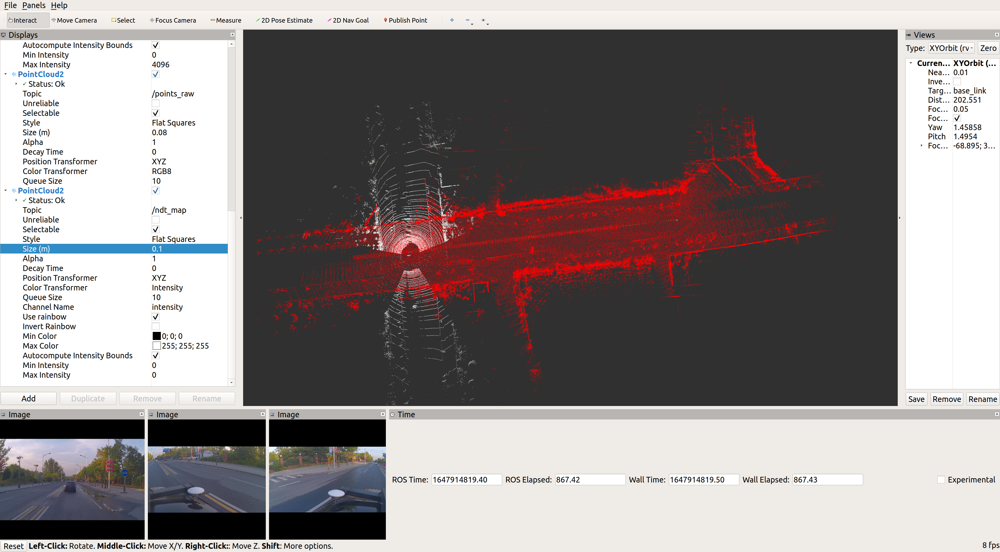

# 基于相机和激光雷达融合RGB点云建图及后处理项目
# 准备数据集
官方提供的数据集如下所示，包括激光雷达和相机数据，其中激光雷达数据存储在`pcd_data/`下,共99帧点云; 
相机数据在`image_data/`下，包含一个前置相机和两个后置相机，各含有99帧图片.   
激光雷达和相机同步: 图片文件名和点云文件名虽然匹配不上，但将其分别按数字从小到大排列后，是一一对应的.   
参数: 在`params/`下有7个yaml文件，分别表示相机的内参、外参和激光雷达的外参. 其中相机内参用于描述透视成像模型，所有外参表示对应传感器坐标系与车体坐标系的转换关系.
```tree
~/.autoware/rgb_mapping_data/
├── gt_pose_data
│   └── 20191021162130
│       └── vechicle_poses.txt
├── image_data
│   ├── front
│   │   ├── 1571647370_656743.jpg
│   │   ├── ...
│   │   └── 1571647380_459888.jpg
│   ├── left_back
            ...
│   └── right_back
            ...
├── params
│   ├── front_camera_extrinsic.yaml
│   ├── front_camera_intrinsic.yaml
│   ├── left_back_camera_extrinsic.yaml
│   ├── left_back_camera_intrinsic.yaml
│   ├── lidar_extrinsic.yaml
│   ├── right_back_camera_extrinsic.yaml
│   └── right_back_camera_intrinsic.yaml
└── pcd_data
    ├── 11673.pcd
    ├── ...
    └── 11771.pcd

8 directories, 404 files

```

**注意:** 在`rgb_mapping_data/params/*extrinsic.yaml`中所有的`vehicle`被错误拼写成了`vechicle`.
出于强迫症,我把它们都改正了,如果要运行我的代码,也要做同样的修改.  

# 整体思路
编写一个节点`load_params_node`负责处理`rgb_mapping_data/params/`文件夹下的所有参数文件:  
1. 将激光雷达和相机外参转换为tf变换，并以静态tf的形式发布出来,供其他节点查询；
2. 将相机内参转换为`sensor_msgs/CameraInfo`格式的消息，并创建一个服务器，接收相机`frame_id`,返回相机内参`camera_info`.

编写一个传感器数据读取节点，依次读取单帧点云和三个相机的单帧图像，组合在一起作为请求发送给着色服务器，得到着色后的rgb点云，发布到`/color_cloud`话题上.

编写一个点云着色节点`pointcloud_shader_server`, 创建着色服务器`PointCloudShader`，首先查询tf信息和相机内参信息并缓存在节点内部, 然后接收单帧点云和三张图像，将原始点云投影到像素坐标系, 获得点云的rgb信息, 生成rgb点云, 返回给客户端节点.

启动ndt_mapping，基于雷达原始数据`/lidar/points_raw`进行建图，
并同时通过`rosbag record`录制建图过程中的TF信息`/tf /static_tf`、RGB点云`/color_cloud`、车体相对于地图坐标的位姿`/current_pose`.


播放上一步录制的数据包，并订阅其中的`/color_cloud`和`/current_pose`，进行同步后,将rgb点云转换到地图坐标系，然后叠加到地图中，最后保存为pcd文件

# 实现

功能包详细内容放在[catkin_ws/src/rgb_mapping](catkin_ws/src/rgb_mapping/)文件夹下.


## 读取参数文件
本项目提供的参数文件是`yaml`格式, 但与`OpenCV`里面常用的又不一样，经过调研，发现可以用ros参数服务器来管理这些参数，具体做法是: 在`launch`文件中通过`<rosparam file="" ns=""/>`来将参数从文件读取到ros的参数服务器,然后在节点中访问参数服务器获取参数具体数值, 将外参转换为tf信息发布，将内参转换为CameraInfo，供其他节点查询.

关于`rosparam`可以参考:
- http://wiki.ros.org/rosparam
- http://wiki.ros.org/roscpp/Overview/Parameter%20Server
- https://www.ncnynl.com/archives/201702/1295.html
- https://blog.csdn.net/m0_38087936/article/details/86655949


1. 创建功能包
```bash
$  cd ~ && mkdir -p catkin_homework_ws/src && cd catkin_homework_ws/src # 创建工作空间
$ catkin_create_pkg rgb_mapping std_msgs rospy roscpp sensor_msgs tf2 tf2_ros cv_bridge # 创建功能包
$ cd .. && catkin_make
$ rospack profile # 刷新功能包列表
$ source devel/setup.bash # 使工作空间生效
```

2. 在`src/autoware/custom/rgb_mapping/`目录下添加如下文件(文件内容稍后解释):  
- src/load_params_node.cpp
- srv/getCameraInfo.srv
- launch/load_params.launch
- launch/test_load_params.launch


3. 修改`src/autoware/custom/rgb_mapping/package.xml`: 
- 由于使用了自定义服务类型，在`package.xml`中需要添加如下两行(只需在文件内取消注释即可).
```xml
<build_depend>message_generation</build_depend>
<exec_depend>message_runtime</exec_depend>
```


4. 修改`src/autoware/custom/rgb_mapping/CMakeLists.txt`:
- 由于本项目需要用到`OpenCV`,
  - 在`find_package()`中添加`OpenCV`
  - 在`find_package()`上部添加`set(OpenCV_DIR /usr/local/share/OpenCV/)`保证系统能够找到`OpenCV`.
  - 在`include_directories`中添加`${OpenCV_INCLUDE_DIRS}`、`${catkin_INCLUDE_DIRS}`.
- 由于本项目需要用到自定义服务类型
  - 在`find_package()`中添加`message_generation`
  - 在`add_service_files`中添加服务类型文件`getCameraInfo.srv`
  - 在`generate_messages()`中添加依赖`sensor_msgs`和`std_msgs`
- 添加编译目标和链接库
  - `add_executable(load_params_node src/load_params_node.cpp)`
  - `target_link_libraries(load_params_node ${catkin_LIBRARIES} ${OpenCV_LIBRARIES})`

<details>
  <summary>如果没安装OpenCV,可按照如下步骤安装.(点击展开)</summary>

由于之前安装了`libopencv-dev3.2.0`，因此安装的OpenCV版本必须一致，否则会冲突.
新建`installOpencv320.sh`文件，内容如下:   
```bash
echo "** Install requirement"
sudo apt-get update
sudo apt-get install -y build-essential cmake git libgtk2.0-dev pkg-config libavcodec-dev libavformat-dev libswscale-dev
sudo apt-get install -y libgstreamer1.0-dev libgstreamer-plugins-base1.0-dev
sudo apt-get install -y python2.7-dev
sudo apt-get install -y python-dev python-numpy libtbb2 libtbb-dev libjpeg-dev libpng-dev libtiff-dev libjasper-dev libdc1394-22-dev
sudo apt-get install -y libv4l-dev v4l-utils qv4l2 v4l2ucp
sudo apt-get install -y curl
sudo apt-get update
echo "** Download opencv-3.2.0"
curl -L https://github.com/opencv/opencv/archive/3.2.0.zip -o opencv-3.2.0.zip
unzip opencv-3.2.0.zip
cd opencv-3.2.0/
echo "** Building..."
mkdir build
cd build/
cmake -D WITH_CUDA=OFF -D BUILD_TESTS=OFF -D BUILD_PERF_TESTS=OFF -D BUILD_EXAMPLES=OFF -D CMAKE_BUILD_TYPE=RELEASE -D ENABLE_PRECOMPILED_HEADERS=OFF -D CMAKE_INSTALL_PREFIX=/usr/local ..
make -j16
sudo make install
echo "** Install opencv-3.2.0 successfully"
```

执行脚本下载并安装`OpenCV 3.2.0`
```bash
chmod +x installOpencv320.sh
./installOpencv320.sh
```
</details>


5. 编译运行

```bash
$ cd ~/catkin_homework_ws && catkin_make
$ source devel/setup.bash 
$ roslaunch rgb_mapping test_load_params.launch # 启动相关节点
$ rosservice call /rgb_mapping/load_params_node/getCameraInfo "frame_id: 'right_back_camera_intrinsic'"  # 调用服务，查询指定相机的内参
```

- 在调用终端显示如下信息,表示所查询的相机内参`camera_info`
```bash
lsy@ubuntu1804:~/catkin_homework_ws$ rosservice call /rgb_mapping/load_params_node/getCameraInfo "frame_id: 'right_back_camera_intrinsic'" 
camera_info: 
  header: 
    seq: 0
    stamp: 
      secs: 1647770922
      nsecs: 670741545
    frame_id: "right_back_camera_intrinsic"
  height: 1080
  width: 1920
  distortion_model: "plumb_bob"
  D: [-0.3551790080881572, 0.11967321969589267, -0.0003173118675430524, -0.0006677077113026503, 0.0]
  K: [1367.1424652706953, 0.0, 950.7491362405574, 0.0, 1362.566999878343, 551.3703172749548, 0.0, 0.0, 1.0]
  R: [1.0, 0.0, 0.0, 0.0, 1.0, 0.0, 0.0, 0.0, 1.0]
  P: [1089.0794677734375, 0.0, 943.109514474665, 0.0, 0.0, 1281.6746826171875, 552.6297016696226, 0.0, 0.0, 0.0, 1.0, 4.64115057803336e-310]
  binning_x: 0
  binning_y: 0
  roi: 
    x_offset: 0
    y_offset: 0
    height: 0
    width: 0
    do_rectify: False

```

- 在`rqt_tf_tree`和`rviz`中显示传感器外参如下图所示.
<div align="center">


</div>

# 传感器数据读取

1. 在`src/autoware/custom/rgb_mapping/`目录下添加如下文件:  
- src/load_sensors_data_node.cpp
- launch/load_sensors_data.launch
- launch/test_load_sensors_data.launch
- config/sensors_data.rviz # 可以在界面手动添加后，选择另存，来生成该文件

2. 修改`src/autoware/custom/rgb_mapping/package.xml`: 
- 由于需要使用pcl点云库，在`package.xml`中需要添加如下依赖.
```xml
<build_depend>pcl_conversions</build_depend>
<build_depend>pcl_ros</build_depend>
<build_export_depend>pcl_conversions</build_export_depend>
<build_export_depend>pcl_ros</build_export_depend>
<exec_depend>pcl_conversions</exec_depend>
<exec_depend>pcl_ros</exec_depend>
```

3. 修改`src/autoware/custom/rgb_mapping/CMakeLists.txt`:
- 在`find_package()`中添加`pcl_conversions`和`pcl_ros`
- 添加编译目标和链接库
  - `add_executable(load_sensors_data_node src/load_sensors_data_node.cpp)`
  - `target_link_libraries(load_sensors_data_node ${catkin_LIBRARIES} ${OpenCV_LIBRARIES})`

4. 编译运行
```bash
$ cd ~/catkin_homework_ws && catkin_make
$ source devel/setup.bash 
$ roslaunch rgb_mapping test_load_sensors_data.launch # 启动相关节点
```

<div align="center">

</div>

# 点云着色

参考:    
- [相机雷达数据融合 - KevinJia1212/colored_pointcloud - Github](https://github.com/KevinJia1212/colored_pointcloud)
- 在`src/autoware/visualization/`中有一个官方功能包`points2image`实现了将点云投影到图像的功能，可作为参考.

1. 在`src/autoware/custom/rgb_mapping/`目录下添加如下文件:  
- src/pointcloud_shader_server.cpp
- launch/test_pointcloud_shader.launch
- config/pointcloud_shader.rviz # 可以在界面手动添加后，选择另存，来生成该文件

2. 修改`src/autoware/custom/rgb_mapping/package.xml`: 
- 由于需要进行tf与eigen之间的转换，这依赖于`tf2_eigen`，在`package.xml`中需要添加如下依赖.
```xml
  <build_depend>tf2_eigen</build_depend>
  <build_export_depend>tf2_eigen</build_export_depend>
  <exec_depend>tf2_eigen</exec_depend>
```

3. 修改`src/autoware/custom/rgb_mapping/CMakeLists.txt`:
- 在`find_package()`中添加`tf2_eigen`
- 添加编译目标和链接库
  - `add_executable(pointcloud_shader_server src/pointcloud_shader_server.cpp)`
  - `target_link_libraries(pointcloud_shader_server ${catkin_LIBRARIES} ${OpenCV_LIBRARIES})`

4. 编译运行
```bash
$ cd ~/catkin_homework_ws && catkin_make
$ source devel/setup.bash 
$ roslaunch rgb_mapping test_pointcloud_shader.launch # 启动相关节点
```
如下图所示，`rviz`中显示了两个点云: 白色点云的是从pcd文件中读取到的原始点云数据，RGB点云是经过着色服务器处理过后的点云(只有在三个相机的视野范围内才能进行相机与激光雷达的数据融合). `rviz`中还显示了三个相机的原始图像,作为参照来判断数据融合是否正确.
<div align="center">

</div>


# 建图
1. 新建`test_rgb_mapping.launch`文件
- 在文件内通过`remap`将话题`/lidar/points_raw`重映射为`ndt_mapping`所需的`/points_raw`. 
- 发布静态tf： `base_link2vehicle`， `lidar2velodyne`， `world2map`，这几个坐标变换都是没有平移和旋转的，为的是将本项目中的坐标架转换为`ndt_mapping`中默认的坐标架.
- 通过`rosbag record`录制话题`/tf /tf_static /color_cloud /points_raw /current_pose`，留待下一步用于拼接RGB点云地图.

2. 新建`new_mapping.launch`并放到autoware功能包: `~/autoware-1.13/install/lidar_localizer/share/lidar_localizer/launch/new_mapping.launch`
```xml
<launch>
  <!-- T_baselink_velodyne -->
  <param name="tf_x"   value="0.010524"/>
  <param name="tf_y"   value="1.613485"/>
  <param name="tf_z"   value="1.228857"/>
  <param name="tf_roll"   value="0.0055624"/> <!-- 四元数 -> 欧拉角(ZYX) -->
  <param name="tf_pitch"   value="0.0166705"/>
  <param name="tf_yaw"   value="1.5730094"/>
  <param name="localizer"   value="velodyne"/>
  <param name="use_sim_time"   value="false"/>
  <arg name="use_imu" value="false" />
  <!-- ndt_mapping --> 
  <include file="$(find lidar_localizer)/launch/ndt_mapping.launch"/>
</launch>
```

该文件中的`<param/>`节点往ROS参数服务器中设置了几个参数，这是因为`autoware`的`ndt_mapping`源码中是从参数服务器获取`base_link2velodyne`的变换的，而不是查询TF (简直无语了)
所以我要想调用autoware来帮我建图，就必须把雷达外参转换为`x y z roll pitch yaw`的形式，并放入参数服务器中.
然后通过`<include/>`添加`ndt_mapping.launch`启动ndt_mapping, 监听`/points_raw`话题进行建图.

- [rotationconverter online](https://www.andre-gaschler.com/rotationconverter/)
- [quaternions.online](https://quaternions.online/)

3. 在`autoware`工作空间中`source install/setup.bash`后执行 `roslaunch lidar_localizer new_mapping.launch`.
4. 运行`test_rgb_mapping.launch`开始数据融合并发布RGB点云: `roslaunch rgb_mapping test_rgb_mapping.launch`
  
<!-- 执行`3. 4.`两步之后在rviz界面就可以看到正在建图了 -->

<!-- <div align="center">

</div> -->


在启动`ndt_mapping`之后的`tf tree`如下图所示, `map`和`base_link`之间有连接表示在正常建图.

<div align="center">

</div>

建图完成后终止运行`test_rgb_mapping.launch`, 然后在`~/.autoware/rgb_mapping_data/`文件夹下会出现一个`rgb_mapping.bag`数据包
```bash
lsy@ubuntu1804:src/autoware/custom/rgb_mapping$ rosbag info rgb_mapping.bag 
path:        rgb_mapping.bag
version:     2.0
duration:    12:16s (736s)
start:       Mar 30 2022 11:54:24.65 (1648612464.65)
end:         Mar 30 2022 12:06:41.31 (1648613201.31)
size:        320.6 MB
messages:    400
compression: none [199/199 chunks]
types:       geometry_msgs/PoseStamped [d3812c3cbc69362b77dc0b19b345f8f5]
             sensor_msgs/PointCloud2   [1158d486dd51d683ce2f1be655c3c181]
             tf2_msgs/TFMessage        [94810edda583a504dfda3829e70d7eec]
topics:      /color_cloud    99 msgs    : sensor_msgs/PointCloud2  
             /current_pose   99 msgs    : geometry_msgs/PoseStamped
             /points_raw     99 msgs    : sensor_msgs/PointCloud2  
             /tf             99 msgs    : tf2_msgs/TFMessage       
             /tf_static       4 msgs    : tf2_msgs/TFMessage        (4 connections)
```


# 拼接RGB点云地图


1. 在`src/autoware/custom/rgb_mapping/`目录下添加如下文件:  
- src/rgb_mapping.cpp
- launch/test_build_rgb_map.launch


2. 修改`src/autoware/custom/rgb_mapping/CMakeLists.txt`:
- 在`find_package()`中添加`eigen_conversions`
- 添加编译目标和链接库
  - `add_executable(rgb_mapping src/rgb_mapping.cpp)`
  - `target_link_libraries(rgb_mapping ${catkin_LIBRARIES} ${OpenCV_LIBRARIES})`

3. 编译运行
```bash
$ cd ~/catkin_homework_ws && catkin_make
$ source devel/setup.bash 
$ roslaunch rgb_mapping test_build_rgb_map.launch # 启动相关节点
```

该部分创建了两个订阅器节点，分别订阅`/color_cloud`和`/current_pose`,其中前者是将原始的激光点云着色后又转换回到雷达坐标系的rgb点云，后者是经过`ndt_mapping`建图得到的每一帧中`base_link`坐标系相对于地图坐标系`map`的位姿，此外还需查询TF获取雷达相对于车体的位姿.
这样最终可以把所有的`/color_cloud`从`lidar`坐标系变换到`map`坐标系,统一坐标系后直接简单相加即可得到拼接好的RGB点云地图`.ros/rgb_map.pcd`

<div align="center">

</div>


